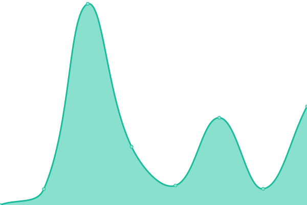

# [📈 Live Status](https://Invicta-AI.github.io/invicta-ai-upptime): <!--live status--> **🟩 All systems operational**

This repository contains the open-source uptime monitor and status page for [Invicta AI](https://invictai.io/), powered by [Upptime](https://github.com/upptime/upptime).

With [Upptime](https://upptime.js.org), you can get your own unlimited and free uptime monitor and status page, powered entirely by a GitHub repository. We use [Issues](https://github.com/Invicta-AI/invicta-ai-upptime/issues) as incident reports, [Actions](https://github.com/Invicta-AI/invicta-ai-upptime/actions) as uptime monitors, and [Pages](https://Invicta-AI.github.io/invicta-ai-upptime) for the status page.

<!--start: status pages-->
<!-- This summary is generated by Upptime (https://github.com/upptime/upptime) -->
<!-- Do not edit this manually, your changes will be overwritten -->
<!-- prettier-ignore -->
| URL | Status | History | Response Time | Uptime |
| --- | ------ | ------- | ------------- | ------ |
|  [Invicta AI](https://invictai.io) | 🟩 Up | [invicta-ai.yml](https://github.com/Invicta-AI/invicta-ai-upptime/commits/HEAD/history/invicta-ai.yml) | 

 918ms
     
 | 

<a href="https://Invicta-AI.github.io/invicta-ai-upptime/history/invicta-ai">99.61%</a>
    

|  [Invicta AI App](https://app.invictai.io) | 🟩 Up | [invicta-ai-app.yml](https://github.com/Invicta-AI/invicta-ai-upptime/commits/HEAD/history/invicta-ai-app.yml) | 

 482ms
     
 | 

<a href="https://Invicta-AI.github.io/invicta-ai-upptime/history/invicta-ai-app">99.62%</a>
    

|  [Invicta AI Docs](https://info.invictai.io) | 🟩 Up | [invicta-ai-docs.yml](https://github.com/Invicta-AI/invicta-ai-upptime/commits/HEAD/history/invicta-ai-docs.yml) | 

 550ms
     
 | 

<a href="https://Invicta-AI.github.io/invicta-ai-upptime/history/invicta-ai-docs">99.16%</a>
    

<!--end: status pages-->

[**Visit our status website →**](https://Invicta-AI.github.io/invicta-ai-upptime)

## 📄 License

- Powered by: [Upptime](https://github.com/upptime/upptime)
- Code: [MIT](./LICENSE) © [Anand Chowdhary](https://anandchowdhary.com), supported by [Pabio](https://pabio.com)
- Data in the `./history` directory: [Open Database License](https://opendatacommons.org/licenses/odbl/1-0/)
